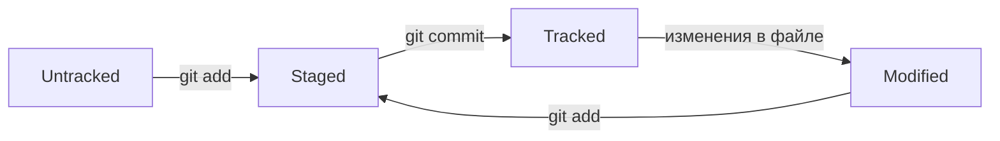

# Справочник полезных команд


## CLI Навигация
___


1. ```pwd``` (от англ. print working directory, «показать рабочую папку») — покажи, в какой я папке;


2. ```ls``` (от англ. list directory contents, «отобразить содержимое директории») — покажи файлы и папки в текущей папке;
* ``` ls -a``` — покажи также скрытые файлы и папки, названия которых начинаются с символа .;


3. ```cd first-project``` (от англ. change directory, «сменить директорию») — перейди в папку first-project;
* ```cd first-project/html``` — перейди в папку html, которая находится в папке first-project;<br>
* ```cd ..``` — перейди на уровень выше, в родительскую папку;<br>
* ```cd ~``` — перейди в домашнюю директорию (/Users/Username);<br>
* ```cd /``` — перейди в корневую директорию.


## Работа с файлами и папками
___


### Создание


1. ```touch index.html``` (англ. touch, «коснуться») — создай файл index.html в текущей папке;
* ```touch index.html style.css script.js``` — если нужно создать сразу несколько файлов, можно напечатать их имена в одну строку через пробел;


2. ```nano text.txt``` - если необходимо создать файл и приступить к его редактированию (или отредактировать уже существующий);


3. ```mkdir second-project``` (от англ. make directory, «создать директорию») — создай папку с именем second-project в текущей папке.


### Копирование и перемещение


1. ```cp file.txt ~/my-dir``` (от англ. copy, «копировать») — скопируй файл в другое место;


2. ```mv file.txt ~/my-dir``` (от англ. move, «переместить») — перемести файл или папку в другое место.


### Чтение


1. ```cat file.txt``` (от англ. concatenate and print, «объединить и распечатать») — распечатай содержимое текстового файла file.txt.


### Удаление


1. ```rm about.html``` (от англ. remove, «удалить») — удали файл about.html;


2. ```rmdir images``` (от англ. remove directory, «удалить директорию») — удали папку images;


3. ```rm -r second-project``` (от англ. remove, «удалить» + recursive, «рекурсивный») — удали папку second-project и всё, что она содержит.


## Полезные возможности


* Команды необязательно печатать и выполнять по очереди. Можно указать их списком — разделить двумя амперсандами (&&).<br>
* У консоли есть собственная память — буфер с несколькими последними командами. По ним можно перемещаться с помощью клавиш со стрелками вверх (↑) и вниз(↓).<br>
* Чтобы не вводить название файла или папки полностью, можно набрать первые символы имени и дважды нажать Tab. Если файл или папка есть в текущей директории, командная строка допишет путь сама.<br> 
Например, вы находитесь в папке dev. Начните вводить cd first и дважды нажмите Tab. Если папка first-project есть внутри dev, командная строка автоматически подставит её имя. Останется только нажать Enter.


# Переходим к изучению Git!
___


## Хеш — идентификатор коммита


* Git преобразует информацию о коммитах с помощью алгоритма SHA-1 и для каждого из них рассчитывает уникальный идентификатор — хеш.
* Хеш — основной идентификатор коммита и позволяет узнать его автора, дату и содержимое закоммиченных файлов.
* Все хеши, а также таблицу соответствий ```хеш → информация о коммите``` Git хранит в папке ```.git```.


## Исследуем лог


После вызова ```git log``` появляется список коммитов.<br>
Разберём элементы, из которых состоит описание:
* строка из цифр и латинских букв после слова commit — это хеш коммита;
* Author — имя автора и его электронная почта;
* Date — дата и время создания коммита;
* в конце находится сообщение коммита.


*Получить сокращённый лог — ```git log --oneline```*


Сокращённый лог полезен, если в репозитории уже много коммитов — например, сотни или тысячи.<br>
В этом случае можно быстро найти нужный по описанию.<br>
Сокращённый хеш (то есть первые несколько символов полного) можно использовать точно так же, как и полный.<br>
Для этого команда ```git log --oneline``` автоматически подбирает такую длину сокращённых хешей, чтобы они были уникальными в пределах репозитория и Git всегда мог понять, о каком коммите идёт речь.


## Файл ```HEAD```


Файл ```HEAD``` (англ. «голова», «головной») — один из служебных файлов папки ```.git```. Он указывает на коммит, который сделан последним (то есть на самый новый).
В этом можно убедиться с помощью терминала. Перейдите в папку ```.git``` командой ```cd```. Посмотрите содержимое файла ```HEAD``` командой ```cat```.


```
$ pwd # посмотрели, где мы
/Users/user/dev/first-project

$ cd .git/
$ ls # посмотрели, какие есть файлы
COMMIT_EDITMSG  ORIG_HEAD  description  index  logs/     refs/
HEAD            config     hooks/       info/  objects/

$ cat HEAD # команда cat показывает содержимое файла
ref: refs/heads/master # в файле вот такая ссылка
```
 
Внутри ```HEAD``` — ссылка на служебный файл: ```refs/heads/master``` (или ```refs/heads/main``` в зависимости от названия ветки). Если заглянуть в этот файл, можно увидеть хеш последнего коммита.


```
$ cat refs/heads/master # взяли ссылку из файла HEAD
# внутри хеш
e007f5035f113f9abca78fe2149c593959da5eb7

$ git log 
# сверяем с хешем последнего коммита
commit e007f5035f113f9abca78fe2149c593959da5eb7
Author: John Doe <johndoe@example.com>
Date:   Tue Mar 28 00:26:53 2023 +0300

    Добавить амбиций в список дел

... # другие коммиты
```

 
Когда вы делаете коммит, Git обновляет ```refs/heads/master``` — записывает в него хеш последнего коммита. Получается, что ```HEAD``` тоже обновляется, так как ссылается на ```refs/heads/master```.<br>
При работе с Git указатель HEAD используется довольно часто. Многие команды Git принимают в качестве параметра хеш коммита.<br> 
Если нужно передать последний коммит, то вместо его хеша можно просто написать слово ```HEAD```.


## Статусы файлов в Git




*Пояснение:*<br>
* ```Untracked``` — новый файл, который Git ещё не отслеживает.
* ```Modified``` — файл изменён, но изменения не добавлены в индекс (```git add```).
* ```Staged``` — файл добавлен в индекс (подготовлен к коммиту).
* ```Tracked``` — файл зафиксирован в репозитории (после ```git commit```).


*Как это работает:*<br>
1. Новый файл (```Untracked```) --> ```git add``` --> ```Staged```.
2. Изменённый файл (```Modified```) --> ```git add``` --> ```Staged```.
3. ```Staged``` --> ```git commit``` --> ```Tracked``` (попадает в историю Git).
4. Если файл ```Tracked``` изменяется -->  снова ```Modified```.
